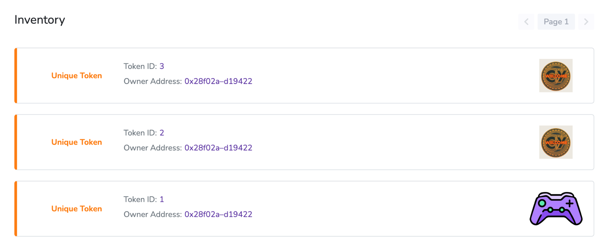

  -----------------------------------------------------------------------
  **Cymetaverse Chain 토큰 및 NFT 발행 가이드**
  -----------------------------------------------------------------------

  -----------------------------------------------------------------------

□ CRC-20 토큰 발행

1.  크롬에 메타마스크 확장 프로그램을
    설치 <https://chrome.google.com/webstore/detail/metamask/nkbihfbeogaeaoehlefnkodbefgpgknn>

2.  지갑 생성 후 '네트워크 추가' 버튼 클릭

3.  아래 정보 입력 후 저장

-   네트워크 이름: Cymetaverse Chain

-   새 RPC URL: <http://node0.cymetaversechain.com:8540>

-   체인 ID: 7989

-   통화 기호: DOTR

-   블록 탐색기 URL: <https://explorer.cymetaversechain.com> (option)

4.  <https://remix.ethereum.org> 접속

5.  좌측 상단의 문서 모양 클릭 후 token.sol 파일 생성

6.  [https://bafkreiclusgyp46w4hkju7ezzeu6kd2xcs2nalyyev3zktz3n4kmupkjsu.ipfs.nftstorage.link](https://bafkreiclusgyp46w4hkju7ezzeu6kd2xcs2nalyyev3zktz3n4kmupkjsu.ipfs.nftstorage.link/)

위 코드 입력 후 TestToken Contract에서 원하는 토큰 심볼, 이름, 데시멀,
발행수량을 입력

7.  왼쪽 버튼 클릭 후 'Compile' 버튼 클릭

8.  ENVIROMENT에서 Injected Web3 선택 후 메타마스크에서 '다음' 버튼 클릭
    후 연결

9.  CONTRACT에서 TestToken 선택 후 'Deploy' 버튼 클릭 후 메타마스크에서
    '확인' 클릭

10. Transaction hash 복사 후 <https://explorer.cymetaversechain.com/>
    접속

11. 복사한 Transaction Hash 입력 후 검색

12. 정상적으로 배포되었는지 확인 후 Tokens Minted의 'Test' 클릭

13. 토큰 이름, 심볼, 전체 수량 확인

□ Metadata URI 생성

1.  [https://nft.storage](https://nft.storage/) 접속 후 회원가입

2.  상단 Files 클릭 -- 업로드 원하는 이미지 첨부 후 Upload 버튼 클릭

3.  Actions 클릭 후 Copy IPFS URL 클릭

4.  welcome.json 파일 생성 후 아래의 내용 입력 후 저장

-   image에 아까 복사한 IPFS URL 입력

+-----------------------------------------------------------------------+
| {                                                                     |
|                                                                       |
| \"name\": \"welcome card\",                                           |
|                                                                       |
| \"image\":\"                                                          |
| ipfs://bafybeidcbaf4qhhqufx4bryowfxzhfl5eakc6cclbhquarynvuzbljhtga\", |
|                                                                       |
| \"description\": \"welcome\"                                          |
|                                                                       |
| }                                                                     |
+=======================================================================+
+-----------------------------------------------------------------------+

5.  [https://nft.storage](https://nft.storage/) 접속 후 상단 Files 클릭
    후 Upload 버튼 클릭 후 welcome.json 업로드

6.  Actions 클릭 후 View URL 클릭 후 주소 저장

□ CRC-721 토큰 발행(NFT)

1.  좌측 상단의 문서 모양 클릭 후 my_nft.sol 파일 생성

2.  <https://bafkreiclusgyp46w4hkju7ezzeu6kd2xcs2nalyyev3zktz3n4kmupkjsu.ipfs.nftstorage.link/>

> 위 코드 입력 후 '컴파일' 버튼 클릭

3.  컴파일 / 배포 시 에러 날 경우 Advanced Configurations에서 EVM
    VERSION을 byzantium으로 변경

4.  ENVIROMENT에서 Injected Web3 선택 후 메타마스크 연결

> 

5.  CONTRACT에서 MyNft 선택 후 TOKENNAME/SYMBOL 입력

6.  'transact' 버튼 클릭 후 메타마스크에서 '확인' 클릭

7.  Deployed Contracts에서 배포된 MYNFT 클릭 후 mintToken 우측의
    '화살표' 클릭

8.  Id / owner / metadataURI (Metadata URI 생성 참고) 입력 후 'transact'
    버튼 클릭 후

메타마스크 확인 버튼 클릭

9.  Transaction Hash 복사 후 <https://explorer.cymetaversechain.com/>
    접속 후 검색

10. 트랜잭션 정상 배포 확인 후 Tokens Minted의 MNT 클릭

11. NFT 컨트랙트 배포 시 입력한 NFT name 및 symbol 확인

12. Inventory에 발행한 NFT 토큰 확인

13. Inventory의 토큰 ID 클릭 후 NFT 토큰 정보 및 메타데이터 확인 가능

> 
